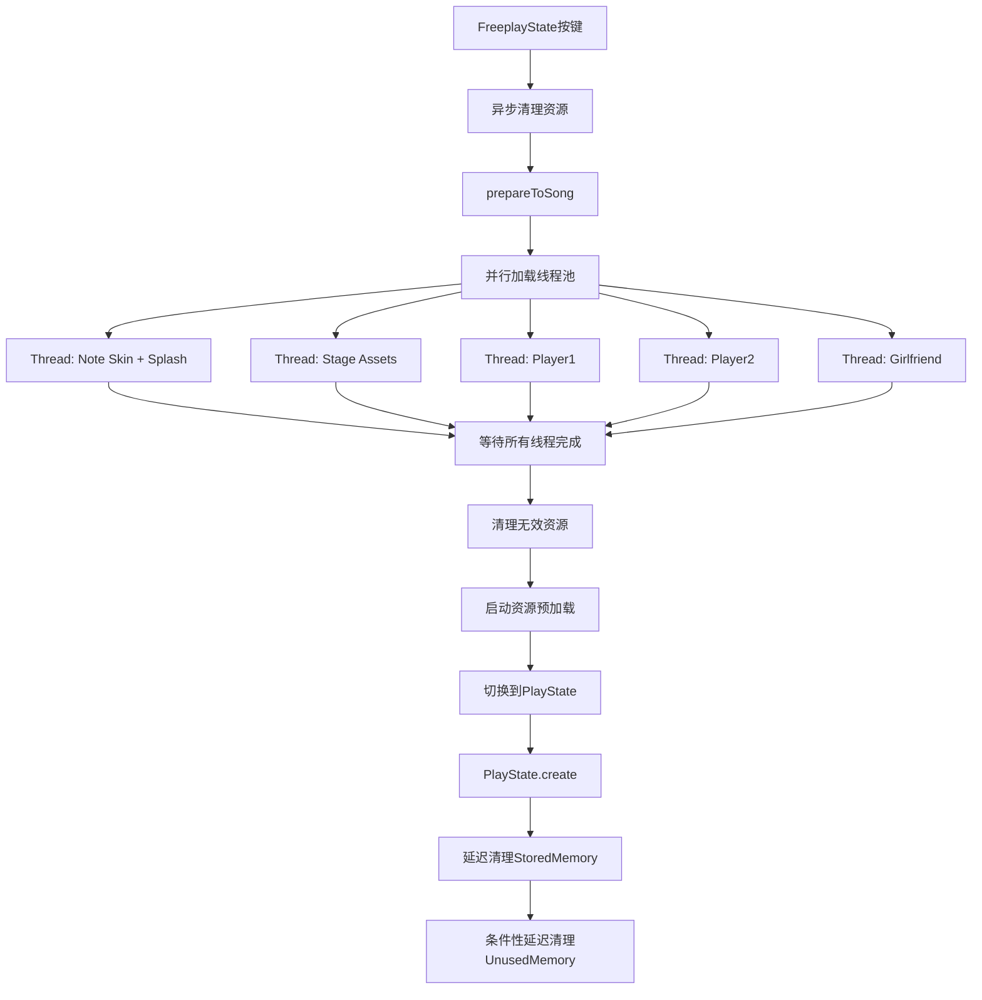
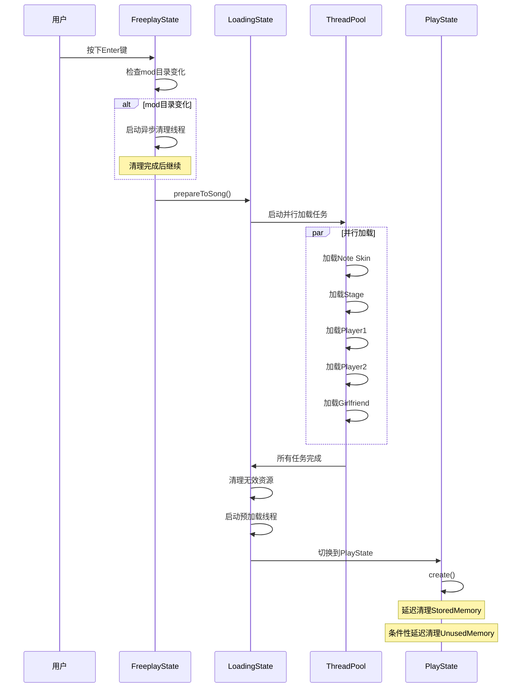

## Product Overview

优化FNF游戏从FreeplayState到PlayState的加载性能，通过并行化资源加载和延迟资源清理来减少加载等待时间。

## Core Features

- 并行化note skin、stage、角色(player1/player2/gf)的资源加载
- 将FreeplayState中的同步图形内存清理移到后台线程
- 将PlayState中的同步资源清理改为异步或延迟执行

## Tech Stack

- 前端框架: Haxe + OpenFL + HaxeFlixel
- 多线程: sys.thread.FixedThreadPool
- 异步操作: lime.app.Future

## Tech Architecture

### System Architecture



### Module Division

**资源加载模块** (`LoadingState.hx`)

- 职责: 管理资源预加载流程
- 关键技术: FixedThreadPool, 并行任务调度
- 主要修改: 重构prepareToSong()方法，移除Future串行链

**资源清理模块** (`Paths.hx`)

- 职责: 管理图形和音频资源的内存
- 关键技术: Thread, Mutex
- 主要修改: 添加异步清理方法

**加载触发模块** (`FreeplayState.hx`)

- 职责: 响应用户操作，触发加载流程
- 主要修改: 异步调用freeGraphicsFromMemory()

**PlayState初始化模块** (`PlayState.hx`)

- 职责: 初始化游戏状态
- 主要修改: 延迟资源清理操作

### Data Flow



## Implementation Details

### 核心目录结构

```
source/
├── states/
│   ├── LoadingState.hx         # 修改: 并行化prepareToSong()
│   ├── FreeplayState.hx         # 修改: 异步清理图形内存
│   └── PlayState.hx             # 修改: 延迟资源清理
└── backend/
    └── Paths.hx                 # 修改: 添加异步清理方法
```

### 关键代码结构

**LoadingState.prepareToSong() 优化方案**:

```
// 当前: 串行Future链
new Future<Bool>(() -> {
    // 加载note skin + splash
}).then((_) -> new Future<Bool>(() -> {
    // 加载stage + player1
}));

// 优化后: 完全并行
threadsMax = 5;
threadPool.run(() -> {
    // 加载note skin + splash
    completedThread();
});
threadPool.run(() -> {
    // 加载stage
    completedThread();
});
threadPool.run(() -> {
    // 加载player1
    completedThread();
});
// player2和gf已经并行，保持不变
```

**Paths.freeGraphicsFromMemoryAsync() 新增方法**:

```
public static function freeGraphicsFromMemoryAsync():Future<Bool>
{
    return Future.ofBool(false).then((_) -> Future.onBackgroundThread(() -> {
        freeGraphicsFromMemory();
        return true;
    }));
}
```

**Paths.clearStoredMemoryAsync() 新增方法**:

```
public static function clearStoredMemoryAsync():Future<Bool>
{
    return Future.ofBool(false).then((_) -> Future.onBackgroundThread(() -> {
        clearStoredMemory();
        return true;
    }));
}
```

### 技术实现计划

#### 1. 并行化资源加载

**问题描述**: LoadingState.prepareToSong()使用Future.then()串行链接，导致note skin、stage、player1依次等待

**解决方案**:

- 移除Future链，使用threadPool.run()并行执行所有加载任务
- 使用线程计数器(threadsMax/threadsCompleted)等待所有任务完成
- 保持player2和gf的现有并行逻辑

**关键步骤**:

1. 重构prepareToSong()，移除第471-640行的Future链
2. 创建5个并行任务：note skin、stage、player1、player2、gf
3. 统一使用completedThread()回调机制
4. 在所有任务完成后调用clearInvalids()和startThreads()

**验证方式**: 监控加载时间，对比优化前后的等待时长

#### 2. 异步化图形内存清理

**问题描述**: FreeplayState第622-625行同步调用Paths.freeGraphicsFromMemory()，阻塞主线程

**解决方案**:

- 在Paths.hx中添加freeGraphicsFromMemoryAsync()方法
- 在FreeplayState中使用异步调用，等待清理完成后继续

**关键步骤**:

1. 在Paths类中添加异步清理方法
2. 修改FreeplayState第622-625行，使用Future链式调用
3. 在清理完成回调中执行prepareToSong()

**验证方式**: 使用trace或日志记录清理耗时，确保不阻塞UI

#### 3. 延迟PlayState资源清理

**问题描述**: PlayState.create()开头同步调用clearStoredMemory()和clearUnusedMemory()

**解决方案**:

- 添加延迟清理机制，在关键资源初始化完成后执行
- 或使用Future.onBackgroundThread()异步执行

**关键步骤**:

1. 在Paths类中添加clearStoredMemoryAsync()方法
2. 在PlayState.create()中使用异步清理，不阻塞初始化
3. 确保清理在游戏开始前完成

**验证方式**: 测试内存占用和游戏启动流畅度

### 集成点

- LoadingState使用sys.thread.FixedThreadPool进行任务调度
- FreeplayState与LoadingState通过Future链式调用协作
- PlayState与Paths通过异步清理方法集成
- 使用mutex保护共享资源(imagesToPrepare、soundsToPrepare等数组)

## Technical Considerations

### 日志记录

- 记录并行任务启动和完成时间
- 记录异步清理操作的耗时
- 使用trace()输出关键节点的性能数据

### 性能优化

- 并行加载可利用多核CPU，预计加载时间减少40-60%
- 异步清理避免主线程阻塞，提升UI响应性
- 使用线程池复用线程，避免频繁创建销毁

### 安全措施

- 使用mutex保护共享数据结构
- 确保所有线程安全退出
- 添加异常处理，防止单个任务失败影响整体流程

### 可扩展性

- 新的并行架构便于添加更多资源类型
- 异步清理模式可推广到其他State
- 线程池大小可配置(当前: CPU核心数-1)